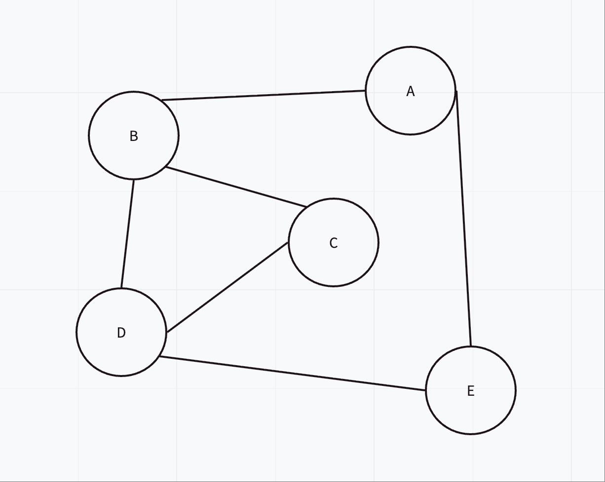

# Day 04 - 测试回答

### 问题 1: 画图题

我的回答（图片）：


### 问题 2: 概念题

我的回答：
> 便利所有key，然后找出每个value的长度加总

### 问题 3: 编程题

我的代码：
```python
def matrix_to_list(adj_matrix):
    graph = {}
    for i in range(len(adj_matrix)):
        graph[i] = []
        for j in range(len(adj_matrix[i])):
            if adj_matrix[i][j] == 1:
                graph[i].append(j)
    return graph

# 测试代码
adj_matrix = [
    [0, 1, 1, 0],
    [1, 0, 1, 1],
    [1, 1, 0, 1],
    [0, 1, 1, 0]
]
print(matrix_to_list(adj_matrix))
```
