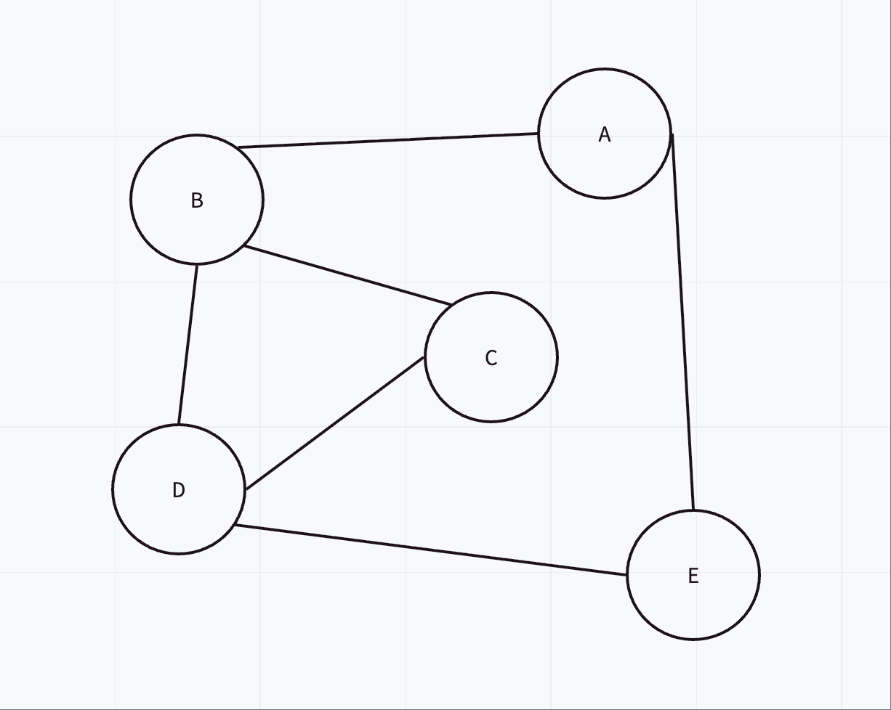

# Day 04 - 测试反馈

### 总结

你今天的表现非常出色！对邻接表的概念理解很到位，编程能力也很强。

---

### **问题 1: 画图题**

**评判：正确**

你画的图完全正确，精确地反映了邻接表所描述的顶点和边的关系。



---

### **问题 2: 概念题**

**评判：基本正确（有待补充）**

你的思路“便利所有key，然后找出每个value的长度加总”是正确的方向，这计算出了图中所有顶点的**度数之和**。

根据图论的**握手定理**，一个无向图中所有顶点的度数之和等于边数的两倍 (`Σdeg(v) = 2E`)。

因此，在你的计算方法基础上，需要将最终得到的总和**除以 2**，才能得到图中实际的边数。

**完整方法**：将邻接表中所有列表的长度相加，然后将总和除以 2。

---

### **问题 3: 编程题**

**评判：完全正确**

你的 Python 函数写得非常好，逻辑清晰，代码简洁。它能够完美地实现从邻接矩阵到邻接表的转换。

```python
def matrix_to_list(adj_matrix):
    graph = {}
    # 遍历每一行，i 代表每个顶点
    for i in range(len(adj_matrix)):
        graph[i] = [] # 为每个顶点初始化一个空的邻接列表
        # 遍历行中的每一列，j 代表潜在的邻居
        for j in range(len(adj_matrix[i])):
            # 如果矩阵值为1，说明 i 和 j 之间有边
            if adj_matrix[i][j] == 1:
                graph[i].append(j) # 将邻居 j 添加到 i 的列表中
    return graph
```
这个实现是高效且正确的。做得很好！
